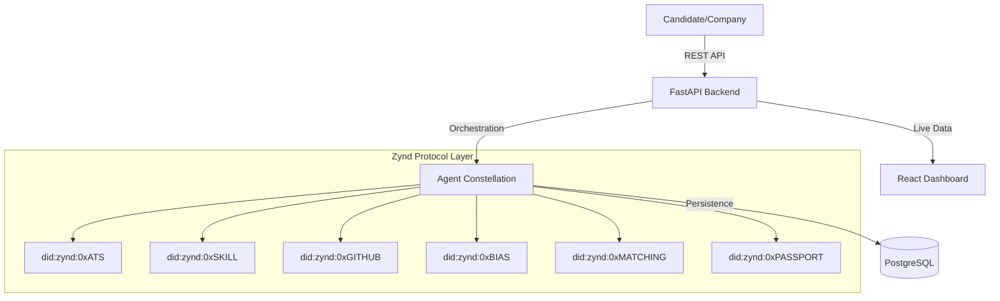

# Fair Hiring Network (FHN) 🚀
### Agentic AI-Driven Skill Verification & Fairness Protocol

The **Fair Hiring Network (FHN)** is a next-generation hiring platform that leverages **Zynd AI** to create a decentralized, transparent, and bias-free recruitment ecosystem.

---

## 🛠️ Quick Start (Demo Mode)

The system is configured with a **Demo Mode** that launches all agents with visible logs in separate windows. This is the recommended way to explore the platform.

### 1. Prerequisites
- **Python 3.10+** (Recommend using a virtual environment)
- **Node.js 18+**
- **PostgreSQL** (Running and configured in `.env`)
- **Ollama** (Running locally for LLM-based verification)

### 2. Backend & Agents (One Command)
Run the following from the root directory to launch the FastAPI backend and all 8 Zynd agents (ATS, Skill, Bias, Matching, Passport, etc.):

```powershell
.\start_demo.ps1
```
*Wait for the windows to arrange. If any window crashes, check your `.env` for database connectivity or Zynd API keys.*

### 3. Frontend
In a **separate** terminal, run the React dashboard:

```powershell
cd fair-hiring-frontend
npm install
npm run dev
```
Open [http://localhost:5173](http://localhost:5173) to see the dashboard.

---

## 💡 Key Fix: Match Score Discrepancy (16% Issue)
A critical fix has been applied to the **Matching Agent** logic. Previously, certain candidates showed a persistent "16/100" score due to a normalization error in the skill extraction layer.

- **Status**: ✅ **FIXED** 
- **The Core Cause**: The matcher was failing to parse structured nested dictionaries for skills.
- **Result**: The system now correctly identifies verified skills (e.g., Python, FastAPI) and calculates the **Real Match Score** (including bonus points for strong GitHub evidence and Learning Velocity).

---

## 🏗️ Architecture: The Agent Constellation
FHN is built on a distributed micro-agent architecture orchestrated by the **Zynd SDK**.



---

## 📁 Repository Structure
```
.
├── backend/                # FastAPI Core & Pipelines
├── fair-hiring-frontend/   # React (Vite) Analytics Dashboard
├── agents_services/        # Agent Microservice Wrapper
├── agents_files/           # Core Agent Implementations
├── zynd_integration/       # Zynd SDK Orchestration & DIDs
└── start_demo.ps1          # THE demo launcher
```

---
*Built for the Zynd AI Hackathon. Transforming hiring with transparency and trust.*
