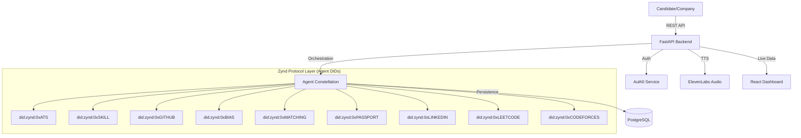

# Fair Hiring Network (FHN) 🚀

### Agentic AI-Driven Skill Verification & Fairness Protocol

The **Fair Hiring Network (FHN)** is a next-generation hiring platform that leverages **Zynd AI** and **Google Gemini** to create a decentralized, transparent, and bias-free recruitment ecosystem. By utilizing a constellation of specialized AI agents, FHN verifies technical skills, audits for bias, and matches candidates based on verified evidence rather than just resumes.

---

## ✨ New Features & Updates

- **🔐 Secure Authentication**: Integrated **Auth0** for seamless and secure candidate/company onboarding.
- **🎙️ Audio Intelligence**: Powered by **ElevenLabs**, the platform now generates post-interview audio breakdowns for recruiters, summarizing candidate performance with high-fidelity TTS.
- **🧠 Advanced LLM Reasoning**: Leverages **Google Gemini 2.0 Flash** for deep analysis of code, resumes, and interview transcripts.
- **📡 Expanded Agent Constellation**: New specialized agents for **LeetCode**, **Codeforces**, and **LinkedIn** verification.
- **✅ Match Score Precision**: Fixed logic for "Real Match Score" calculation, now incorporating GitHub evidence and Learning Velocity.

---

## 🏗️ Architecture: The Agent Constellation

FHN is built on a distributed micro-agent architecture orchestrated by the **Zynd SDK**.



---

## 🛠️ Quick Start (Demo Mode)

The system is configured with a **Demo Mode** that launches all agents with visible logs in separate windows.

### 1. Prerequisites

- **Python 3.10+** (Recommend using a virtual environment)
- **Node.js 18+**
- **PostgreSQL** (Running and configured in `.env`)
- **Ollama** (Running locally for local LLM-based verification)
- **API Keys**: Auth0, ElevenLabs, and Google Gemini (see `.env.example`)

### 2. Launch Backend & Agents

Run the following from the root directory to launch the FastAPI backend and all 9 Zynd agents:

```powershell
.\start_demo.ps1
```

### 3. Launch Frontend

In a **separate** terminal, run the React dashboard:

```powershell
cd fair-hiring-frontend
npm install
npm run dev
```

Open [http://localhost:5173](http://localhost:5173) to see the dashboard.

---

## 💻 Tech Stack

- **Frontend**: React (Vite), Tailwind CSS, Framer Motion, GSAP, Lenis (Smooth Scroll).
- **Backend**: FastAPI (Python), SQLAlchemy, PostgreSQL.
- **AI/ML**: Google Gemini 2.0, ElevenLabs TTS, Ollama (Local LLM).
- **Agentic Infrastructure**: Zynd SDK, Agent DIDs.
- **Auth**: Auth0.

---

## 📁 Repository Structure

```
.
├── backend/                # FastAPI Core ([See Backend README](backend/README.md))
├── fair-hiring-frontend/   # React Dashboard ([See Frontend README](fair-hiring-frontend/README.md))
├── agents_services/        # Agent Microservice Wrapper
├── agents_files/           # Core Agent Implementations
├── zynd_integration/       # Zynd SDK Orchestration & DIDs
├── .agent-ats/             # Specialized Agent Workspace
└── start_demo.ps1          # THE demo launcher
```

---

## 📄 License

This project is licensed under the **MIT License**. See the [LICENSE](LICENSE) file for details.
