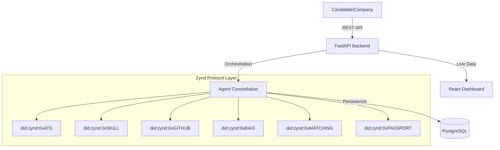

# Fair Hiring Network (FHN) 🚀
### Agentic AI-Driven Skill Verification & Fairness Protocol

The **Fair Hiring Network (FHN)** is a next-generation hiring platform that leverages **Zynd AI** to create a decentralized, transparent, and bias-free recruitment ecosystem. By utilizing a multi-agent constellation, FHN transforms the traditional hiring process into a verifiable, cryptographically-secure pipeline.

---

## 🧠 Core Philosophy
Traditional hiring is opaque and prone to systemic bias. FHN solves this by:
1. **Decentralized Verification**: Skills are verified by autonomous agents with unique DIDs.
2. **Cryptographic Identity**: Every candidate receives a secure `Skill Passport` (Verifiable Credential).
3. **Auditability**: Every decision stage—from ATS screening to bias auditing—is logged and signed using the **Zynd Protocol**.

---

## 🏗️ Architecture: The Agent Constellation
FHN is built on a distributed micro-agent architecture orchestrated by the **Zynd SDK**.



---

## 🛠️ Key Components

### ⚡ The Zynd Trust Layer
*   **DID-Based Identity**: Every agent (e.g., `did:zynd:0xBIAS`) is a sovereign entity.
*   **Tamper-Proof Passports**: Skill Passports are signed with **Ed25519** and verified on every access.
*   **Zynd SDK Integration**: High-performance agent discovery and ZYND-HTTP-SYNC protocols.

### 📊 Real-Time Dashboards
*   **Company Portal**: Live pipeline tracking, fairness audits, and one-click candidate matching.
*   **Candidate Portal**: Secure skill verification, real-time application status, and portable Skill Passports.
*   **Zero-Mock Policy**: All UI metrics are derived directly from real database state and agent outputs.

---

## 🚀 Quick Start (Production Setup)

### Prerequisites
*   **Backend**: Python 3.10+, PostgreSQL 14+
*   **Frontend**: Node.js 18+ (Vite)
*   **Agents**: Ollama (for LLM Runtime)
*   **SDK**: Zynd Python SDK (`zyndai-agent`)

### 1. Environment Configuration
Copy `.env.example` in both `backend/` and `fair-hiring-frontend/` and configure your `DATABASE_URL` and `ZYND_API_KEY`.

### 2. Automated Startup
We recommend using the provided automation script to spin up the entire ecosystem:
```powershell
.\start_system.ps1
```
This script initializes the database, starts all 8 agent services, the FastAPI backend, and the React frontend.

---

## 📈 System Flow
1. **Application**: Candidate applies with a resume and social links (GitHub/LinkedIn).
2. **Evidence Extraction**: The **ATS** and **Harvester** agents extract raw technical signals.
3. **Verification**: The **Skill Agent** synthesizes signals into a verified skills list.
4. **Audit**: The **Bias Agent** checks the process for demographic fairness.
5. **Issuance**: The **Passport Agent** signs and issues the immutable Skill Passport.
6. **Selection**: Company uses the **Matching Agent** to find the perfect technical fit.

---

## 📁 Repository Structure
```
.
├── backend/                # FastAPI Core & Pipelines
├── fair-hiring-frontend/   # React (Vite) Analytics Dashboard
├── agents_services/        # Agent Microservice Wrapper
├── agents_files/           # Core Agent Implementations
└── zynd_integration/       # Zynd SDK Orchestration & DIDs
```

---

## 🤝 Contribution & Contact
Built for the **Zynd AI Hackathon**. Leveraging state-of-the-art decentralized identifiers and agentic workflows to build the future of work.

---
*Generated with ❤️ by the Fair Hiring Network Team.*
